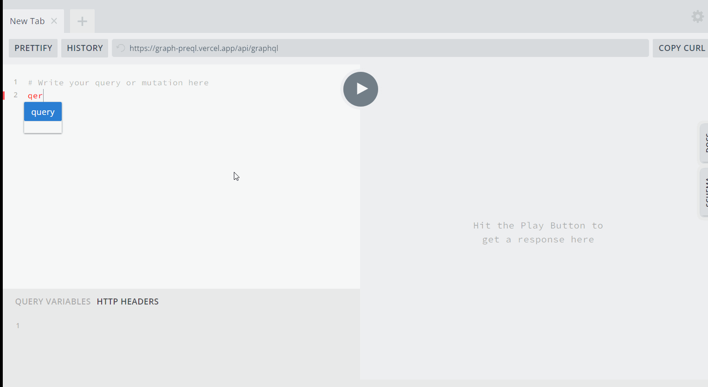

<p align="center">
<a alt="MIT License" href="https://kawakawaritsuki.mit-license.org/">
  
</a>
</p>

<p align="center">Get Precure Information With GraphQL</p>
<div align="center">

[Get PlayGround Demo](https://graph-preql.vercel.app/api/graphql)

</div>

## Graph PreQL とは？

プリキュアシリーズのデータ（プリキュア各キャラ、作品、主題歌）を GraphQL で取得できる非公式 API です。

### 取得できるデータ

#### プリキュア

```
  名前
  プリキュア名
  登場シリーズ
  プリキュアカラー
  プリキュアチームに加入した放送日
  妖精
  変身アイテム
  必殺技
  声優
  声優さんの誕生日
  変身口上
  年齢
  誕生日
```

### シリーズ

```
タイトル
放送開始日
放送終了日
全話数
プロデューサー
シリーズディレクター
シリーズ構成
キャラクターデザイン
音楽
```

### 主題歌

```
タイトル
主題歌作品
放映期間
オープニング、エンディング区分
作詞
作曲
編曲
プリキュアシンガー
```

## デモ



## Install

### Production

```
yarn
yarn build
yarn start
```

### Development

```
yarn
yarn dev
```

## 作者

mu_tomoya

[GitHub](https://github.com/mu_tomoya)
[Qiita](https://qiita.com/mu_tomoya)
